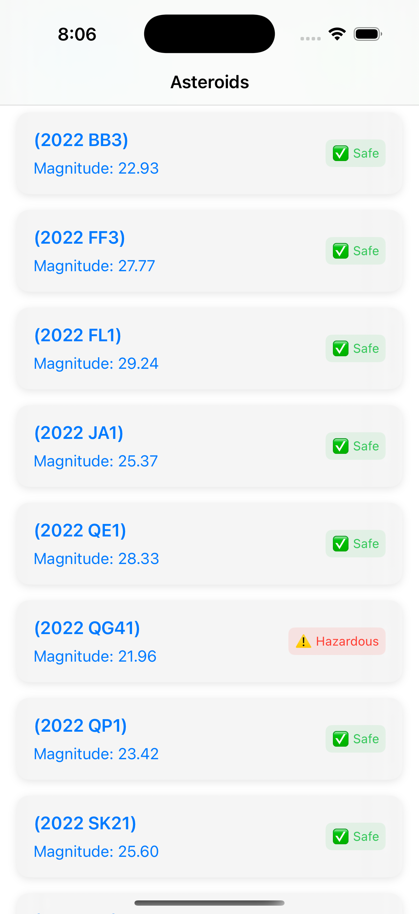
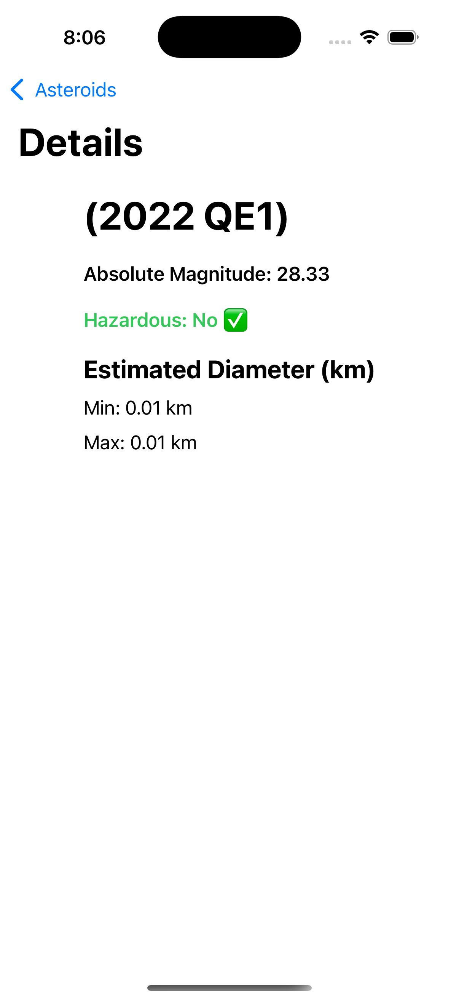
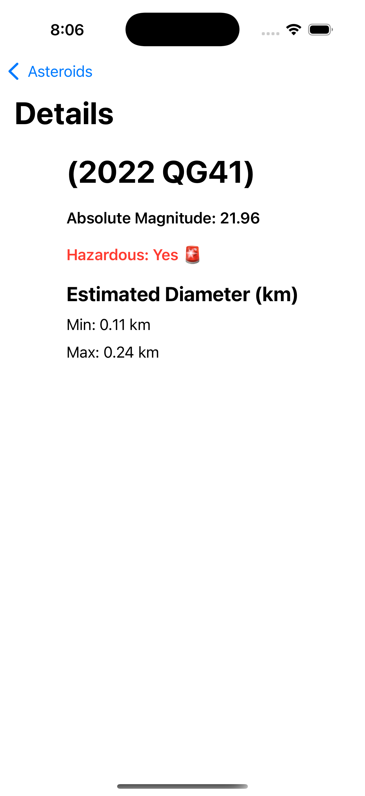

# Asteroids SwiftUI App

This project is a SwiftUI application that fetches near-Earth asteroids from the NASA API and displays them in a list. Users can tap on an asteroid to see detailed information.

---

## Features

- Fetches asteroids using NASA’s Near Earth Object (NEO) API.
- Displays asteroid list with:
  - Name
  - Magnitude
  - Hazardous status
- Detailed view for each asteroid:
  - Estimated diameter
  - Hazardous indicator
  - Absolute magnitude

---

## Requirements

- Xcode 15+
- iOS 16+
- Swift 5.9+
- Internet connection (for real API calls)

---

## Setup Instructions

1. **Clone the repository**

```bash
git clone <repository_url>
cd <project_folder>
```

2. **Open the project in Xcode**

```bash
open Asteroids.xcodeproj
```

3. **Add NASA API Key (optional)**

- By default, the project uses a demo key.
- To use your own key, replace in `NetworkManager.swift`:

```swift
private let apiKey = "YOUR_NASA_API_KEY"
```

4. **Build and run**

- Select your target device or simulator.
- Press **Cmd + R** to build and run.

---

## Testing

### Unit Tests

- Tests are located in `AsteroidsTests/`.
- Includes:
  - `AsteroidViewModelTests` → Testing async loading and error handling.
  - `NetworkManagerTests` → Testing decoding from mock JSON.
- Run with **Cmd + U**.

### UI Tests

- Tests are located in `AsteroidsUITests/`.

---

## Project Structure

```
Asteroids/
├── Models/
│   └── Asteroid.swift
├── Views/
│   ├── AsteroidListView.swift
│   ├── AsteroidRowView.swift
│   └── AsteroidDetailView.swift
├── ViewModels/
│   └── AsteroidViewModel.swift
├── Network/
│   └── NetworkManager.swift
├── Redux/
│   └── Actions.swift
│   ├── Reducer.swift
│   ├── State.swift
│   └── Store.swift
│   ├── ViewModel.swift
│   
└── Assets.xcassets
```

---

## Notes

- Network errors are handled gracefully and displayed in the UI.
## Screenshots

### Asteroid List


### SafeAsteroid Detail


### HazardousAsteroid Detail

